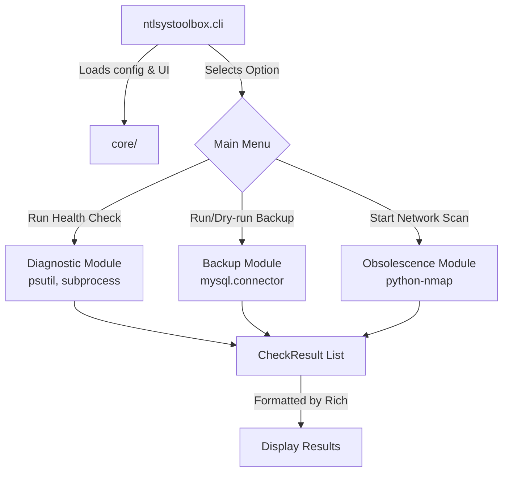

# NTL System Toolbox

A comprehensive CLI utility for system diagnostics, backups, and obsolescence auditing.

## Project Structure

```
ntlsystoolbox/
├── core/               # Core utilities
│   ├── config.py       # Configuration loading
│   ├── logging_conf.py # Logging setup
│   ├── io_utils.py     # TUI helpers (Rich/Questionary)
│   └── models.py       # Data schemas (CheckResult)
├── modules/            # Feature modules
│   ├── diagnostic/     # Services & Health checks (Phase 2)
│   ├── backup/         # Database backups (Phase 3)
│   └── obsolescence/   # EOL & Audit (Phase 4)
└── cli.py              # Main entry point
```

### Architecture Overview



## Installation

1. Create a virtual environment:
   ```bash
   python -m venv venv
   source venv/bin/activate  # or venv\Scripts\activate on Windows
   ```

2. Install dependencies:
   ```bash
   pip install -r requirements.txt
   ```

## Usage

Run the tool using:
```bash
python -m ntlsystoolbox.cli
```
